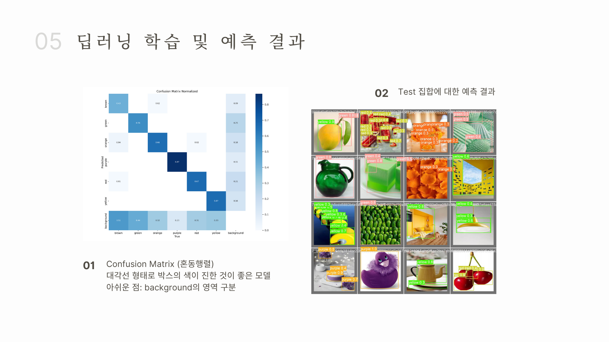
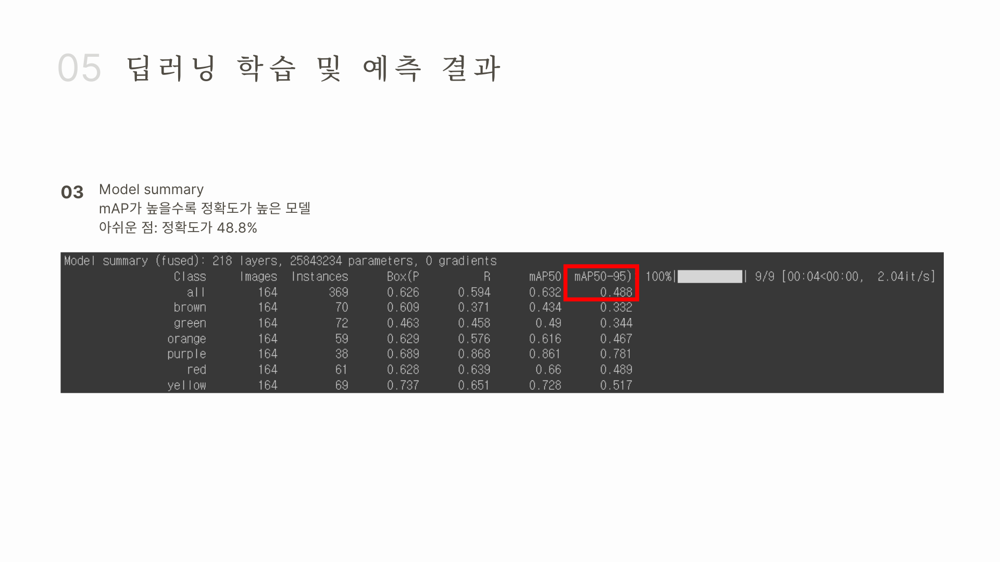

# chromalens
Color Blindness Detection AI Service ChromaLens in 2023 (teamwork)

 
 

## 프로젝트 설명
<li> 색약 - 색맹자들의 새로운 인공지능 렌즈
<li> 색약자들이 일상생활 속에서 불분명한 색채 인식으로 인해 겪을 수 있는 불편함을 해소

 
 

## 기술 스택
**IDE** &nbsp;&nbsp;&nbsp;&nbsp;&nbsp; Colab, Pycharm

**frontend** &nbsp;&nbsp;&nbsp;&nbsp;&nbsp; HTML / CSS 

__backend__ &nbsp;&nbsp;&nbsp;&nbsp;&nbsp; Django framework

__database__ &nbsp;&nbsp;&nbsp;&nbsp;&nbsp; Roboflow CustomDataset <a href="https://universe.roboflow.com/msa-ciwxj/yoon-2"> :art: Color Dataset Link</a>

__model__ &nbsp;&nbsp;&nbsp;&nbsp;&nbsp; YOLOv8m

 
 

## 딥러닝 학습 및 학습 결과

 
 

## 주요 기능
#### 파일 업로드하여 색채 감지 :traffic_light: 

---
#### 웹캠 실시간으로 색채 감지 :traffic_light:

---

